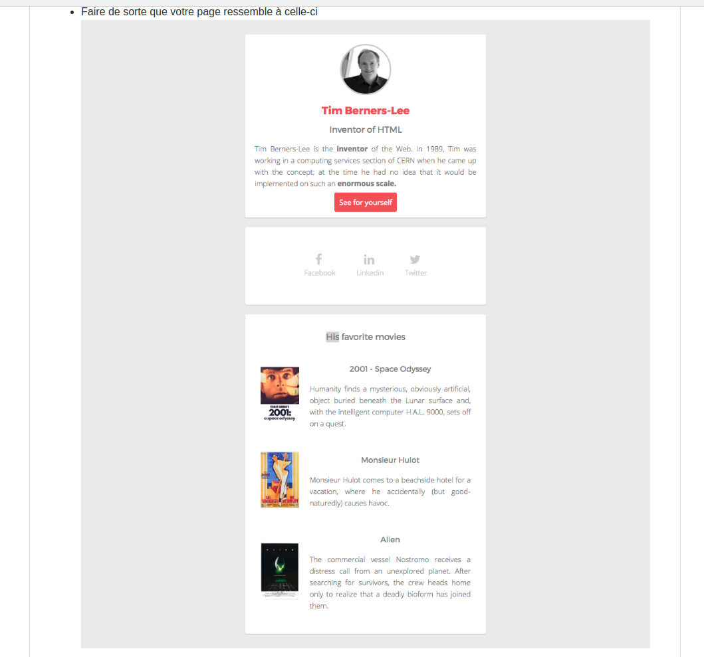

# starting-web-developpment
# Biographie : Tim Berners-Lee

### _Photo de la page web qui a été demandé de reproduire:_ 

## Consignes:
Reproduire cette page web à l'identique sur base d'une photo en utilisant HTML et CSS.
 
## Logiciel utilisé pour coder:
Visual Studio Code

## Lien vers consignes: 
[Consignes GitHub](https://github.com/becodeorg/BXL-Lovelace-3.9/blob/master/parcours/01-La-prairie/html-css/8-exercice-summary.md)

## Langages utilisés:
- HTML
- CSS  

## Responsive? 
Bien évidemment!
